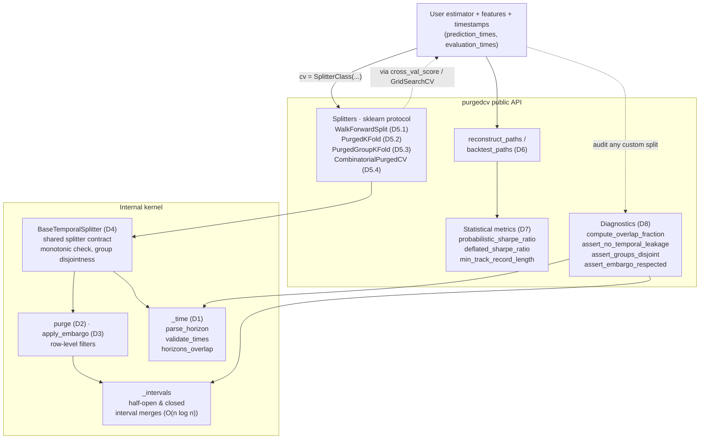

# Architecture

`purgedcv` is organised as a thin public API on top of a small kernel of
interval and time utilities. The diagram below shows the dependency
direction: user code calls a splitter (which already speaks the
scikit-learn protocol), the splitter delegates to one shared base class
that wires `purge` and `apply_embargo` into every fold, and those
primitives share a single interval implementation. The statistical
metrics and the diagnostics module sit alongside the splitters as
independent, leakage-aware tools.

The internal grouping `D1`–`D8` refers to the implementation plan in the
project's CHANGELOG.



## Design rules

Three small invariants keep the surface honest.

1. **One interval implementation.** All overlap and embargo checks go
   through `src/purgedcv/_intervals.py`. `purge`, `apply_embargo`, and the
   diagnostics all sort and merge per-test-row intervals once and then
   stab them with `searchsorted`. Splitters do not duplicate boundary
   logic, and a CPCV fold with non-adjacent test groups is filtered by
   the *union* of local windows rather than by the convex hull between
   them.

2. **Label-aware purge.** Splitters take `prediction_times` and
   `evaluation_times` as pandas Series rather than a single integer gap.
   The purge follows the real label horizon, so a label that overlaps by
   twelve half-hours and one that overlaps by twenty cannot share a
   single hand-tuned `gap` and still be correct — the user passes the
   actual horizon and the splitter does the right thing per row.

3. **Diagnostics are independent.** `compute_overlap_fraction` and the
   three `assert_*` functions accept positional indices, the same
   timestamp series, and an optional purge horizon. They never assume
   their input came from `purgedcv` — they audit any split (sklearn,
   tscv, hand-rolled) the same way. The competitor benchmark on the
   docs site uses them to score every library on equal terms.

## Module layout

```
src/purgedcv/
├── __init__.py          public re-exports; __version__
├── _base.py             BaseTemporalSplitter
├── _walk_forward.py     WalkForwardSplit
├── _purged_kfold.py     PurgedKFold, PurgedGroupKFold
├── _cpcv.py             CombinatorialPurgedCV
├── _paths.py            reconstruct_paths
├── _purge.py            purge
├── _embargo.py          apply_embargo
├── _intervals.py        half-open / closed interval merges
├── _time.py             parse_horizon, validate_times, horizons_overlap
├── _metrics.py          probabilistic_sharpe_ratio, deflated_sharpe_ratio,
│                        min_track_record_length
├── _typing.py           NDArrayAny, HorizonLike
├── diagnostics.py       public audit functions
├── exceptions.py        TemporalCVError tree
└── py.typed             PEP 561 marker — the package is fully typed
```

Wheel contents follow exactly this layout; `tools/` and `examples/`
ride along with the source distribution but are not packaged.
